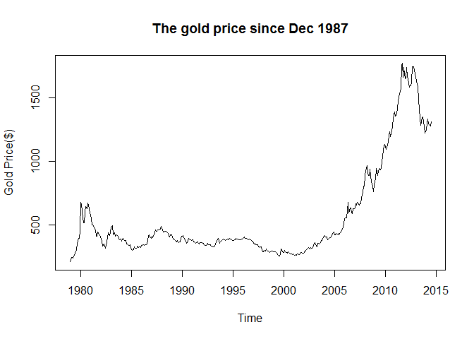
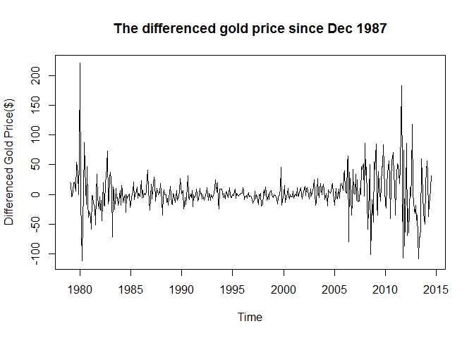
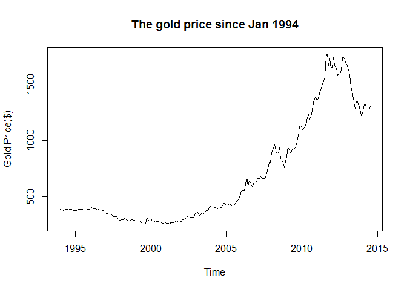
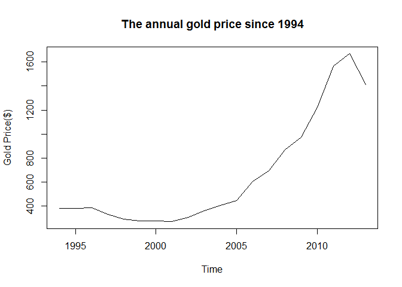
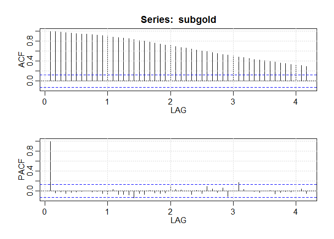
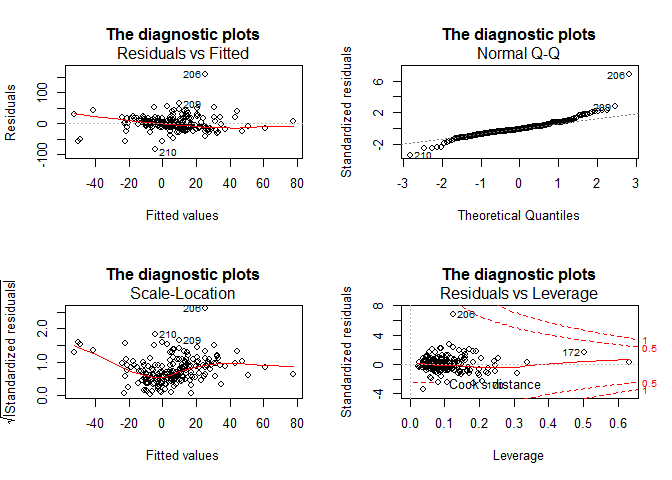
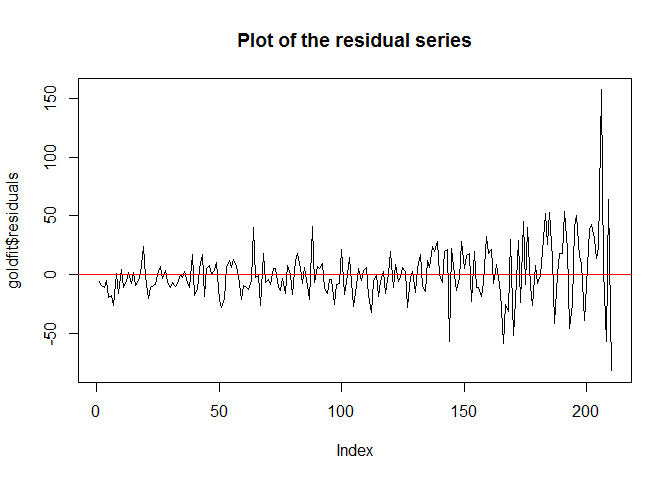
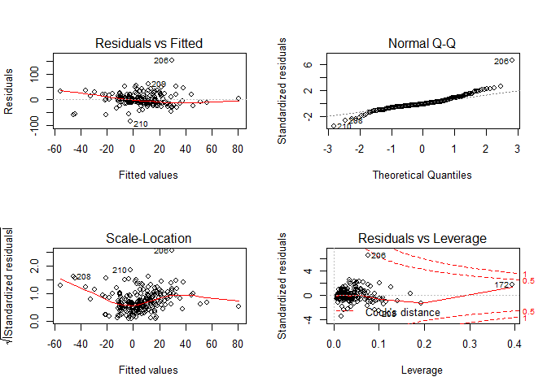
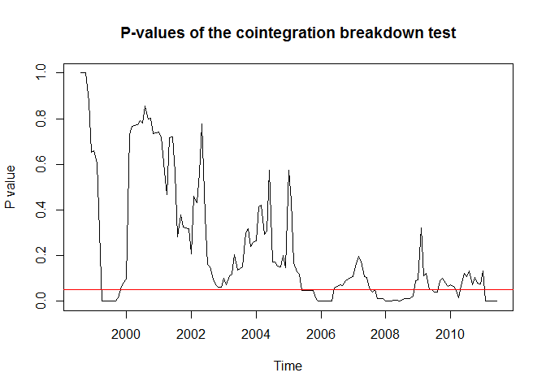

# Gold Paper Report 1
Xiaojun Sun  
WISE, Xiamen University
Sunday, August 17, 2014 


[TOC]

**********************
# Introduction

As disscussed in the paper, 21 independent variables are taken into consideration. They are Australian Dollar(aud), Canadian Dollar(cd), Mexico Peso(mxn), British Pound(gbp), Hong Kong dollar(hkd), Japanese Yen(jpy), South Korean dollar(krd), New Zealand dollar(nzd), South Africa rand(rand), Chilean Peso(clp), Singapore dollar(sgd),Taiwan dollar (twd), Commodity price index(cpx), US CPI(cpi), House price index(hpx), Federal fund interest rate(fedi), Oil price(oil), Japanese NIKKEI stock index(jpsi), Australian Stock index(asx), Average American Stock Index(aasi) and Average European Stock Index(aesi). All variables are availiable after Jan 1991 except Mexico Peso availiable from Nov 1993. The end of the sample period is Dec 2011 because I haven't updated my dataset. I will do that later.

In this report I will present the whole analysis in the paper. And some questions are raised in the end.

# Investigate The Gold Price

The gold price data is provided by World Gold Council([WGC][]). It's availiable from 1978/12/29. In this paper what I use is the monthly average gold price time series data. 


```r
gold <- read.csv("data/gold_all.csv")
gold.ts <- ts(gold, start=c(1978,12), freq=12)
plot(gold.ts, ylab="Gold Price($)", main="The gold price since Dec 1987")
```



```r
dgold <- diff(gold.ts,1)
plot(dgold, ylab="Differenced Gold Price($)", main="The differenced gold price since Dec 1987")
```



Since my sample starts from Jan 1994, I draw the plots for this period.


```r
subgold <- window(gold.ts, start=c(1994,1))
plot(subgold, ylab="Gold Price($)",main="The gold price since Jan 1994")
```



```r
subgold.annual <- aggregate(subgold)/12
plot(subgold.annual, ylab="Gold Price($)",main="The annual gold price since 1994")
```



You can see that the gold price kept increasing for more than 10 years and it begins to decrease recently. We are curious about why the gold price increased so much in the last decade.


```r
library(astsa)
```

```
## Warning: package 'astsa' was built under R version 3.1.1
```

```r
x <- acf2(subgold, 50) ## The ACF and PACF of monthly gold price with max lag=50
```



The above graph is the ACF and PACF of monthly gold price with max lag=50. So the gold price is a AR(1) process.

# Unit Root Tests
## The detailed procedures
First, load the data. Note that my sample period is from **Jan 1994** to **Dec 2011**.


```r
library(RODBC)
conn <- odbcConnectExcel2007("data/alldata(8.17).xlsx",readOnly = TRUE)
oridata <- sqlFetch(conn,"ALL")
odbcClose(conn)
str(oridata) ## see the structure of the original dataset
```

```
## 'data.frame':	252 obs. of  23 variables:
##  $ date: POSIXct, format: "1991-01-01" "1991-02-01" ...
##  $ oil : num  23.6 19.5 19.1 19.2 19.2 ...
##  $ gold: num  384 364 363 358 357 ...
##  $ cpi : num  135 135 135 135 136 ...
##  $ fedi: num  6.91 6.25 6.12 5.91 5.78 5.9 5.82 5.66 5.45 5.21 ...
##  $ cpx : num  81.7 82 82.5 81.5 79 ...
##  $ hpi : num  78.9 78.3 77.7 77.5 77.6 ...
##  $ clp : num  337 338 340 340 340 ...
##  $ rand: num  2.56 2.54 2.66 2.73 2.8 ...
##  $ gbp : num  0.517 0.509 0.549 0.572 0.58 ...
##  $ aud : num  1.28 1.28 1.3 1.28 1.29 ...
##  $ nzd : num  1.68 1.66 1.68 1.7 1.71 ...
##  $ cd  : num  1.16 1.15 1.16 1.15 1.15 ...
##  $ mxn : num  NA NA NA NA NA NA NA NA NA NA ...
##  $ hkd : num  7.79 7.79 7.79 7.79 7.78 ...
##  $ jpy : num  134 131 137 137 138 ...
##  $ krd : num  721 724 728 728 728 ...
##  $ sgd : num  1.75 1.72 1.76 1.77 1.77 ...
##  $ twd : num  27.2 27.1 27.3 27.3 27.3 ...
##  $ aasi: num  4274 4369 4534 4434 4338 ...
##  $ aesi: num  1723 1894 1932 1957 2022 ...
##  $ jpsi: num  23293 26409 26292 26111 25790 ...
##  $ asi : num  1322 1406 1444 1534 1510 ...
```

```r
predata <- do.call(cbind,lapply(oridata[,-1], function(col.data){
    ts.data <- ts(col.data, start=c(1991,1), freq=12)
    return(ts.data)
}))
```

Second, specify the input profile. I make the input profile independent so that it can be modified easily.


```r
profile.default <- list(
    name = "Unit Root Tests",
    urtests = c("adf.test","pp.test","kpss.test"),
    w.start = c(1991,1),
    w.end = c(2011,12)
)
profile.user <- list(
    w.start = c(1994,6) ## the sample period starts from June 1994.
    )
profile <- modifyList(profile.default, profile.user)
```

Then the unit root tests logic.

```r
library(plyr)
library(tseries)
```

```
## 
##     'tseries' version: 0.10-32
## 
##     'tseries' is a package for time series analysis and
##     computational finance.
## 
##     See 'library(help="tseries")' for details.
```

```r
urts <- function(data,profile) {
    d.ts <- window(data, start=profile$w.start, end=profile$w.end)
    res <- do.call(rbind,lapply(profile$urtests, function(fun){
        urtest <- get(fun)
        urtest(diff(d.ts,1))$p.value
    }
                                ))
    return(res)
}

urres <- do.call(cbind, lapply(predata, urts, profile))
```

## The unit root tests output
Now I make a table in which every entry is the p-value resulting from applying the unit root tests(ADF test, PP test and KPSS test) to each time series.


```r
colnames(urres) <- colnames(oridata[,-1])
rownames(urres) <- profile$urtests
knitr::kable(urres[,1:11],format = "markdown", align="c")
```


|          |  oil  | gold  |  cpi  | fedi  |  cpx  |  hpi  |  clp  | rand  |  gbp  |  aud  |  nzd  |
|:---------|:-----:|:-----:|:-----:|:-----:|:-----:|:-----:|:-----:|:-----:|:-----:|:-----:|:-----:|
|adf.test  | 0.010 | 0.010 | 0.010 | 0.083 | 0.010 | 0.568 | 0.010 | 0.010 | 0.010 | 0.010 | 0.010 |
|pp.test   | 0.010 | 0.010 | 0.010 | 0.010 | 0.010 | 0.567 | 0.010 | 0.010 | 0.010 | 0.010 | 0.010 |
|kpss.test | 0.100 | 0.010 | 0.100 | 0.100 | 0.100 | 0.010 | 0.100 | 0.100 | 0.100 | 0.100 | 0.100 |

```r
knitr::kable(urres[,12:22],format = "markdown", align="c")
```


|          |  cd  | mxn  | hkd  | jpy  | krd  | sgd  | twd  | aasi | aesi | jpsi | asi  |
|:---------|:----:|:----:|:----:|:----:|:----:|:----:|:----:|:----:|:----:|:----:|:----:|
|adf.test  | 0.01 | 0.01 | 0.01 | 0.01 | 0.01 | 0.01 | 0.01 | 0.01 | 0.01 | 0.01 | 0.01 |
|pp.test   | 0.01 | 0.01 | 0.01 | 0.01 | 0.01 | 0.01 | 0.01 | 0.01 | 0.01 | 0.01 | 0.01 |
|kpss.test | 0.10 | 0.10 | 0.10 | 0.10 | 0.10 | 0.10 | 0.10 | 0.10 | 0.10 | 0.10 | 0.10 |

Noting that all tests are carried out on the differenced time series, we can conclude from the tables above that all variable are stationary after first differencing. So I will use the differenced data in the model estimation.

# Model Estimation
## Regression including all variables

```r
estdata <- do.call(cbind,lapply(predata, function(pre){
    presub <- window(pre, start=profile$w.start, end=profile$w.end)
    diff(presub, 1)
}))
est <- as.data.frame(estdata) ## convert "mts" to "data.frame"
goldfit <- lm(gold~., data=est)
summary(goldfit)
```

```
## 
## Call:
## lm(formula = gold ~ ., data = est)
## 
## Residuals:
##    Min     1Q Median     3Q    Max 
## -82.24 -11.03  -2.28   9.54 157.53 
## 
## Coefficients:
##              Estimate Std. Error t value Pr(>|t|)    
## (Intercept)  4.61e+00   2.22e+00    2.08  0.03922 *  
## oil          3.17e-01   5.85e-01    0.54  0.58855    
## cpi          2.42e+00   3.21e+00    0.75  0.45244    
## fedi        -1.87e+00   1.07e+01   -0.18  0.86054    
## cpx          1.03e+00   5.97e-01    1.73  0.08444 .  
## hpi         -1.61e-01   1.32e+00   -0.12  0.90326    
## clp         -5.16e-01   1.54e-01   -3.35  0.00099 ***
## rand        -4.68e+00   7.06e+00   -0.66  0.50862    
## gbp         -6.25e+01   1.82e+02   -0.34  0.73119    
## aud         -1.80e+02   9.55e+01   -1.88  0.06150 .  
## nzd          1.55e+02   6.60e+01    2.35  0.01960 *  
## cd          -7.53e+00   1.17e+02   -0.06  0.94860    
## mxn          9.41e+00   7.25e+00    1.30  0.19577    
## hkd         -5.12e+01   2.33e+02   -0.22  0.82623    
## jpy         -8.12e-01   7.79e-01   -1.04  0.29882    
## krd          3.05e-02   4.62e-02    0.66  0.50952    
## sgd         -2.28e+02   1.30e+02   -1.75  0.08227 .  
## twd          3.26e+00   5.92e+00    0.55  0.58240    
## aasi        -1.62e-02   1.78e-02   -0.91  0.36576    
## aesi        -1.71e-02   1.35e-02   -1.26  0.20778    
## jpsi         1.31e-04   2.71e-03    0.05  0.96149    
## asi         -3.26e-02   1.88e-02   -1.74  0.08374 .  
## ---
## Signif. codes:  0 '***' 0.001 '**' 0.01 '*' 0.05 '.' 0.1 ' ' 1
## 
## Residual standard error: 24.8 on 188 degrees of freedom
## Multiple R-squared:  0.35,	Adjusted R-squared:  0.278 
## F-statistic: 4.82 on 21 and 188 DF,  p-value: 1.19e-09
```

```r
## the diagnostic plots
par(mfrow=c(2,2))
plot(goldfit, main="The diagnostic plots")
```



```r
par(mfrow=c(1,1))
plot(goldfit$residuals, type="l", main="Plot of the residual series")
abline(h = 0, col="red")
```



## A simple model selected

Then I use the backward stepwise regression to select a "simple" model.


```r
library(MASS)
ms <- stepAIC(goldfit, direction="backward", trace=F)
ms$anova
```

```
## Stepwise Model Path 
## Analysis of Deviance Table
## 
## Initial Model:
## gold ~ oil + cpi + fedi + cpx + hpi + clp + rand + gbp + aud + 
##     nzd + cd + mxn + hkd + jpy + krd + sgd + twd + aasi + aesi + 
##     jpsi + asi
## 
## Final Model:
## gold ~ cpx + clp + aud + nzd + mxn + sgd + aesi + asi
## 
## 
##      Step Df Deviance Resid. Df Resid. Dev  AIC
## 1                           188     115536 1369
## 2  - jpsi  1     1.44       189     115538 1367
## 3    - cd  1     2.53       190     115540 1365
## 4   - hpi  1     8.64       191     115549 1363
## 5  - fedi  1    31.07       192     115580 1361
## 6   - hkd  1    42.63       193     115623 1359
## 7   - gbp  1    77.27       194     115700 1357
## 8   - oil  1   198.95       195     115899 1356
## 9   - twd  1   208.46       196     116107 1354
## 10 - rand  1   304.72       197     116412 1353
## 11 - aasi  1   409.03       198     116821 1351
## 12  - krd  1   395.94       199     117217 1350
## 13  - jpy  1   637.54       200     117855 1349
## 14  - cpi  1  1004.59       201     118859 1349
```

```r
## then we eatimate the final model
gold.s <- lm(gold ~ cpx + clp + aud + nzd + mxn + sgd + aesi + asi, data=est)
summary(gold.s)
```

```
## 
## Call:
## lm(formula = gold ~ cpx + clp + aud + nzd + mxn + sgd + aesi + 
##     asi, data = est)
## 
## Residuals:
##    Min     1Q Median     3Q    Max 
## -84.38 -11.99  -2.49   9.23 153.15 
## 
## Coefficients:
##              Estimate Std. Error t value Pr(>|t|)    
## (Intercept)    5.4619     1.7487    3.12  0.00205 ** 
## cpx            1.3349     0.4787    2.79  0.00580 ** 
## clp           -0.5183     0.1479   -3.51  0.00056 ***
## aud         -192.3982    82.5642   -2.33  0.02078 *  
## nzd          154.0520    59.8248    2.58  0.01074 *  
## mxn           11.6372     6.6212    1.76  0.08035 .  
## sgd         -220.2810    91.2378   -2.41  0.01666 *  
## aesi          -0.0276     0.0105   -2.63  0.00918 ** 
## asi           -0.0329     0.0165   -1.99  0.04764 *  
## ---
## Signif. codes:  0 '***' 0.001 '**' 0.01 '*' 0.05 '.' 0.1 ' ' 1
## 
## Residual standard error: 24.3 on 201 degrees of freedom
## Multiple R-squared:  0.331,	Adjusted R-squared:  0.305 
## F-statistic: 12.5 on 8 and 201 DF,  p-value: 1.85e-14
```

```r
par(mfrow=c(2,2))
plot(gold.s)
```


So 8 independent variables are selected out and form a simple model `gold ~ cpx + clp + aud + nzd + mxn + sgd + aesi + asi`.
It performs better than the original model.

# Cointegration breakdown test
Now use the cointegration breakdown test which is proposed by [Andrew and Kim (2006)][Andrew2006] to test the break points of gold price.
The model selected out in the last section is used.


```r
library(foreach)
```

```
## foreach: simple, scalable parallel programming from Revolution Analytics
## Use Revolution R for scalability, fault tolerance and more.
## http://www.revolutionanalytics.com
```

```r
library(doParallel)
```

```
## Loading required package: iterators
## Loading required package: parallel
```

```r
library(parallel)

m <- 6  # the length of the breakdown period
tt <- 50:(nrow(estdata)-m) # T in the paper
cl <- makeCluster(detectCores())
clusterExport(cl,c("m","tt","est")) # est comes from section 4.1
registerDoParallel(cl)

pvs <- foreach(t=tt) %dopar% {
    j <- 1:(t-m+1)
    pjs <- do.call(cbind,lapply(j, function(j){
        leave <- j:(j+ceiling(m/2)-1)
        subset <- (1:t)[-leave]
        subest <- est[subset,]
        select <- est[j:(j+m-1),]
        lm <- lm(gold~cpx + clp + aud + nzd + mxn + sgd + aesi + asi, data=subest) 
        ## the model selected out in the last section
        res <- select$gold - predict(lm, newdata = select)
        pj <- t(res)%*%res
        return(pj)
    }))
    estimate <- est[1:(t+m),]
    goldlm <- lm(gold~cpx + clp + aud + nzd + mxn + sgd + aesi + asi, data = estimate)
    m.cal <- (t+1):(t+m)
    calc <- est[m.cal , ]
    end <- calc$gold - predict(goldlm, newdata = calc)## great!!
    p <- t(end)%*%end

    EDF <- ecdf(pjs)
    pvalue <- 1-EDF(p)
    pvalue
}
stopCluster(cl)
```
I make a graph of the P values resulting from the test. 
The breakdowns occur at where the line graph is below the red p-value=0.05 line. 


```r
pvs <- as.numeric(pvs)
start <- profile$w.start
start[1] <- start[1] + floor(tt[1]/12)
start[2] <- start[2] + tt[1] - floor(tt[1]/12)*12
pv.ts = ts(pvs, start= start, freq=12) ## good!
plot(pv.ts, type="l", ylab="P value", main="P-values of the cointegration breakdown test")
abline(h=0.05, col="red")
```


I find that there are cointegration breakdowns in 1999, 2006, 2008 and 2011.

# Questions
I have some questions that listed as below.

- How to select the best model ? I mean there are 21 explanatory variables (too many !). How could we remove the redundant variables ? And how should we choose the appropriate lags for each variable ?
- Cindy mentioned the partial cointegration. How should we model it? Are there any references ?
- We can see that the cointegration breakdown test can detect the breakdown of the gold price time series. But I think we cannot use it for prediction. So what can we use the results of cointegration breakdown test for ?


The End.

**********************
The session information is appended here.

```r
sessionInfo()
```

```
## R version 3.1.0 (2014-04-10)
## Platform: i386-w64-mingw32/i386 (32-bit)
## 
## locale:
## [1] LC_COLLATE=Chinese (Simplified)_People's Republic of China.936 
## [2] LC_CTYPE=Chinese (Simplified)_People's Republic of China.936   
## [3] LC_MONETARY=Chinese (Simplified)_People's Republic of China.936
## [4] LC_NUMERIC=C                                                   
## [5] LC_TIME=Chinese (Simplified)_People's Republic of China.936    
## 
## attached base packages:
## [1] parallel  stats     graphics  grDevices utils     datasets  methods  
## [8] base     
## 
## other attached packages:
## [1] doParallel_1.0.8 iterators_1.0.7  foreach_1.4.2    MASS_7.3-33     
## [5] tseries_0.10-32  plyr_1.8.1       RODBC_1.3-10     astsa_1.2       
## 
## loaded via a namespace (and not attached):
##  [1] codetools_0.2-8  compiler_3.1.0   digest_0.6.4     evaluate_0.5.5  
##  [5] formatR_0.10     grid_3.1.0       htmltools_0.2.4  knitr_1.6       
##  [9] lattice_0.20-29  quadprog_1.5-5   Rcpp_0.11.2      rmarkdown_0.2.49
## [13] stringr_0.6.2    tools_3.1.0      yaml_2.1.13      zoo_1.7-11
```

[WGC]:www.gold.org
[Andrew2006]:http://www.jstor.org/discover/10.2307/27638890?uid=3739560&uid=2&uid=4&uid=3739256&sid=21104597962083
